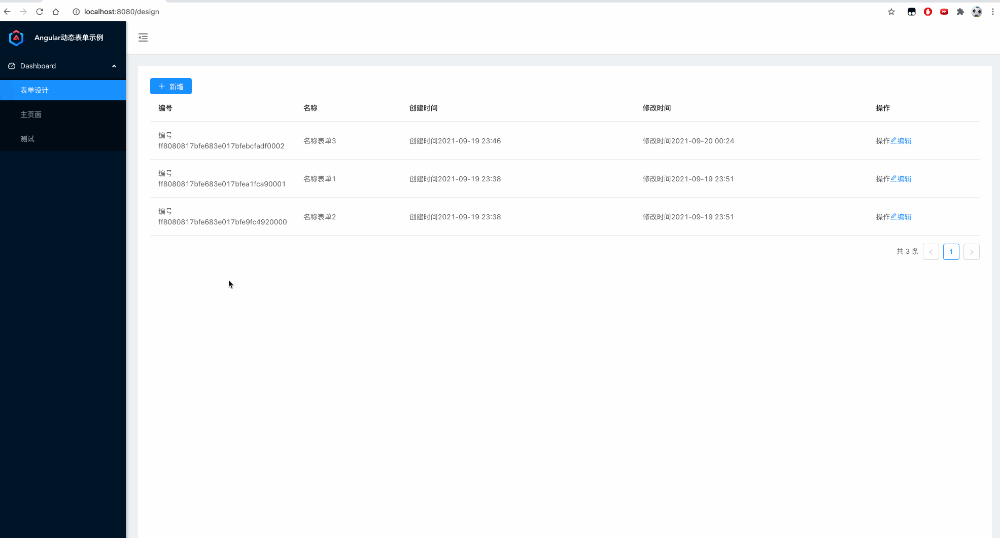

# angular+springboot动态表单示例项目

## 效果图


## 本地运行

1. 安装postgresql
2. 修改数据库连接信息
3. 启动后台项目
4. 访问`http://localhost:8080`


## 技术栈

- 数据库：postgresql13
- 后台：springboot2.3.10.RELEASE
- 前台：angular8、ng-zorro8、[ng-alain@8](https://ng-alain.com/version/8.x/components/table/zh)、[@delon/form@8](https://ng-alain.com/version/8.x/form/getting-started/zh)

## 现存的问题与不足

后台

- 后台项目本身数据库如果不是postgresql，则需要部署一个，然后配置多数据源
- json数据存入库中，再读取出来之后，节点顺序发生了变化，导致表单组件顺序变化

前台

- 表单设计-操作很不方便，最好能实现拖拽
- 可能需要自己再封装一个【列表】组件
- 列表组件【st】会给每行数据前面加上标题
- 未实现：数据列表中需要显示一些表单中的字段，需要按一些字段进行搜索过滤


## 记录

本机docker安装postgresql

```bash
docker run -d -p 5432:5432 --name postgres -v ~/data/postgres/data:/var/lib/postgresql/data -e POSTGRES_PASSWORD=123456 postgres:13.3-alpine
```

postgresql json 函数和运算符：
https://www.postgresql.org/docs/current/functions-json.html
